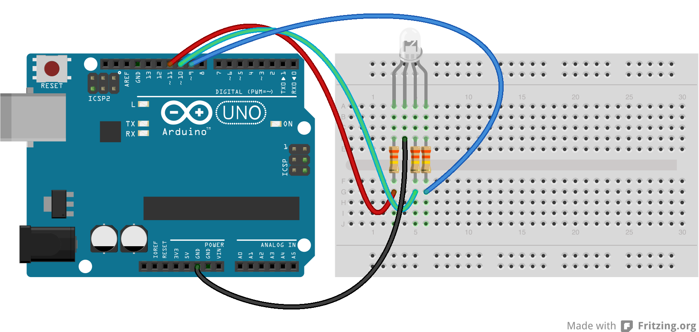

# Lesson 6: RGB LED

In this lesson, we will be using an LED that is actually 3-in-1. It is a red, green, and blue led all together. The neat thing is that by varying the levels of red, green, and blue, you can generate the full color spectrum. Besides experimenting with the RGB LED, we will also use this as an opportunity to learn more about functions. We have been using them since the first lesson, but now you will get to write your own.

## Functions

As you know, functions perform a given task. Some, like ```digitalRead()``` return a value. Other, like ```digitalWrite()``` don't. A custom function might look something like this:

```
void colorRed() {
	// do something
}
```

The function above returns ```void```, which means it doesn't return anything. It also doesn't take in any parameters. If you wanted to be able to pass in parameters, you might do something like:

```
void setLedColor(int red, int green, int blue) {
	// do something with red, green, and blue
}
```

## Assignment 6

Use the things you learned about functions to create custom functions for making the led different colors, following the todos in the provided template. The circuit diagram is shown below.



Copyright © 2013 Gizmovation, LLC