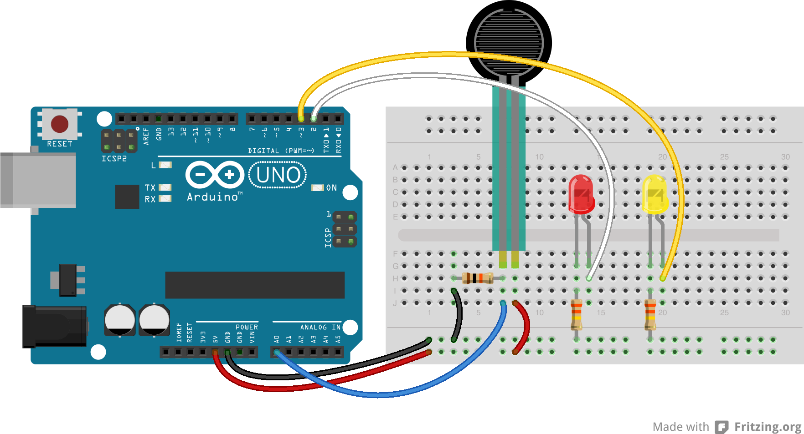
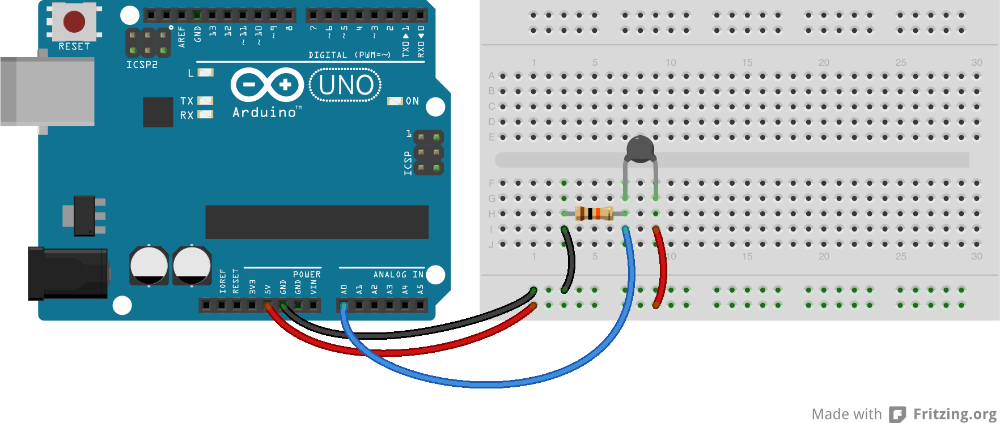
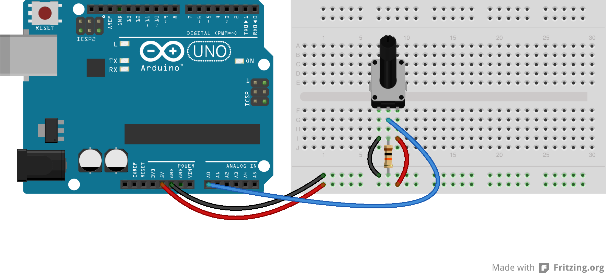

# Lesson 8: Flex Sensor, Thermistor, and Soft Potentiometer

In this lesson, we will be using some new analog sensors. The necessary coding concepts have all been learned in previous lessons.

## Flex Sensor

The flex sensor is another variable resistor. Its resistance is relative to the bend it receives. Bend it one way, the resistance decreases. Bend it the other way it increases.

## Assignment 8 - Flex Sensor

Use the flex sensor as an analog input. Set two threshold values; one for bending down, and the other for bending up. When the sensor value exceeds the up threshold, turn on a red led. When the sensor value exceeds the down threshold, turn on a yellow led. You will need to use the serial monitor to determine the thresholds values. Use the circuit diagram below.

## Thermistor

The flex sensor is yet another variable resistor. Its resistance is relative to its temperature. The colder the detected temperature, the higher the resistance.

## Assignment 8 - Thermistor

Experiment with the thermistor. Obtain some readings via the serial monitor. See if you can turn on and off the leds using the values.

## Soft Potentiometer

The soft potentiometer can be used as a touch sensor. The internal resistance levels change based on where the sensor is touched.

## Assignment 8 - Soft Potentiometer

Experiment with the soft potentiometer. Obtain some readings via the serial monitor. Notice the resistor connecting the middle pin of the soft pot to ground. Try removing it... what happens and why? Of course, make sure you are using the soft pot and not the regular pot as shown in the circuit diagram.

Copyright © 2013-2014 Turner Logic, LLC